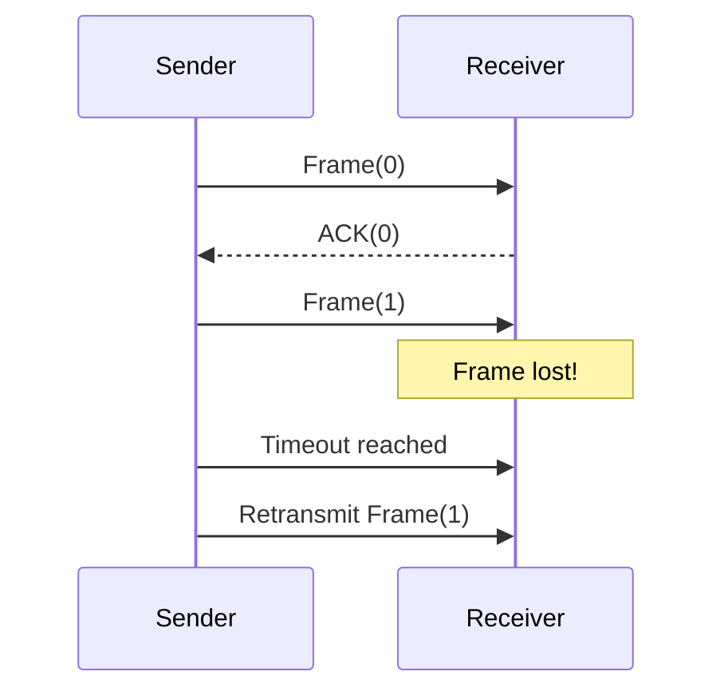

# 🛠️ Datalink Layer Protocols

This folder contains implementations of core flow control and error control algorithms used at the Data Link Layer.

---

## 📦 Contents

### 1. Stop and Wait Protocol
- `1stop_and_wait_sender.py` / `1stop_and_wait_reciver.py`
- `stopsender.py` / `stoprecver.py`
> *Simulates the simplest flow control: Send one frame, wait for acknowledgment.*

### 2. Go-Back-N (GBN) ARQ
- `1go_back_n_sender.py` / `1go_back_n_receiver.py`
- `gobacksender.py` / `gobacksentreceiver.py`
> *Pipelined protocol where the sender can send N frames before needing an ACK. On error, it retransmits all frames from the point of failure.*

### 3. Selective Repeat (SR) ARQ
- `1sr_sender.py` / `1sr_receiver.py`
- `selectARQsender.py` / `selectARQ.py`
> *Optimized pipelining: Only the damaged or lost frames are retransmitted.*

### 🔹 ARQ Simulations (Lab Integrated)
- [**ARQ_Simulations**](./ARQ_Simulations): Comprehensive set of simulations including Stop-and-Wait, GBN, and Selective Repeat with detailed sequence tracking.

---

## 🧪 Simulation Logic


---

## 🚀 Usage
Open two terminals. Run the receiver first:
```bash
python 1stop_and_wait_reciver.py
```
Then run the sender:
```bash
python 1stop_and_wait_sender.py
```
